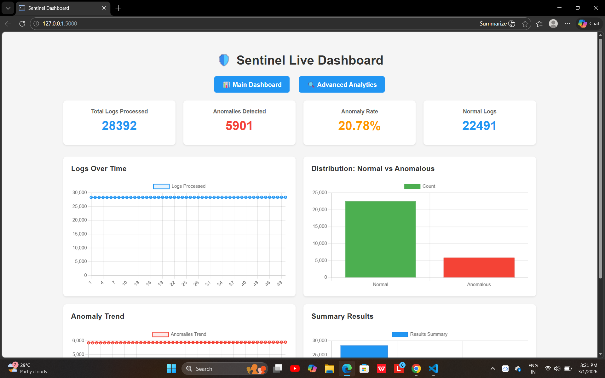
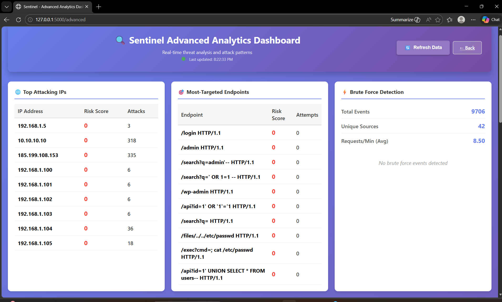
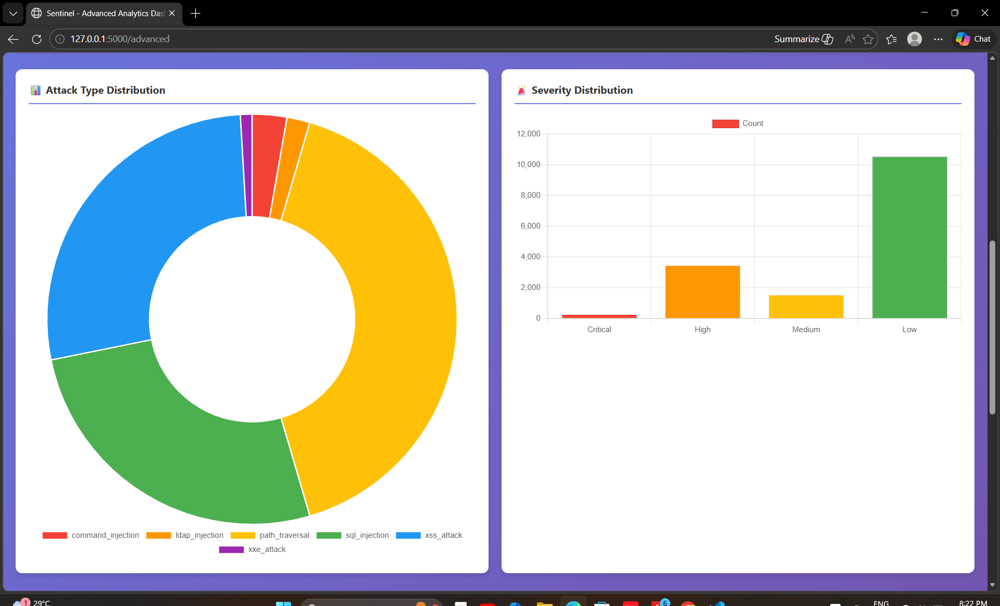
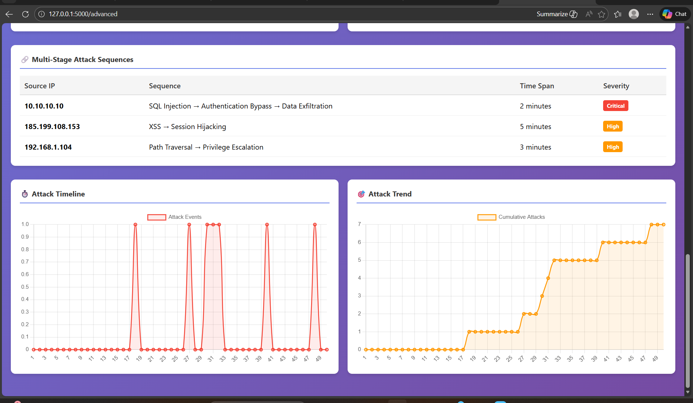
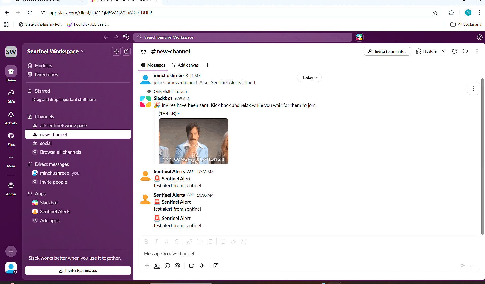

# 🛡️ Sentinel - Real-Time Log Anomaly Detection
Sentinel is a real-time security monitoring system that detects web attacks and anomalous behavior in HTTP logs using a hybrid approach: rule-based signatures + Machine Learning.

It includes a live Flask dashboard, multi-stage attack detection, severity scoring, and Slack alert integration.


## What It Does

- **Detects Attacks** - Spots SQL Injection, XSS, Path Traversal, and other common attacks.
- **Machine Learning** - Uses an AI model to find unusual patterns in logs.
- **Real-Time Alerts** - Notifies you on Slack when something suspicious happens.
- **Live Dashboard** - See your security metrics in a web browser.
- **Tracks Patterns** - Learns which IPs and endpoints are most problematic.

## Setup (First Time Only)

```powershell
# Create virtual environment
python -m venv sentinel_env

# Activate it (Windows)
sentinel_env\Scripts\Activate.ps1

# Install dependencies
pip install -r requirements.txt
```

## Quick Start (3 Terminals)

**Terminal 1: Activate environment & start monitoring**
```powershell
sentinel_env\Scripts\Activate.ps1
python main.py
```

**Terminal 2: Start dashboard**
```powershell
sentinel_env\Scripts\Activate.ps1
python app.py
```

**Terminal 3: View dashboard**
Open your browser to: `http://localhost:5000`

## Test It

Generate fake attacks to see the system in action:
```powershell
sentinel_env\Scripts\Activate.ps1
python test_attacks.py
```
### Slack Alerts (Optional)
Sentinel now uses the Slack Web API via a bot token instead of a simple incoming webhook.


## How It Works

1. **Reads logs** - Monitors your `data/access.log` file in real-time
2. **Parses them** - Extracts IP, URL, status code, user agent, response length, etc.
3. **Detects attacks** - Two-pronged approach:
   - **Pattern Matching** - Checks for known attack signatures (SQL Injection, XSS, Path Traversal, etc.)
   - **Machine Learning** - Uses Isolation Forest algorithm to detect unusual/anomalous requests
4. **Combines results** - Flags anything detected by patterns OR ML model
5. **Alerts** - Sends notifications to Slack with attack details (optional)
6. **Dashboard** - Updates real-time metrics and charts


   ## 📊Dashboard Metrics

Your dashboard displays:
- **Total Logs** - Number of log lines processed.
- **Anomalies Found** - Count of suspicious activities detected.
- **Anomaly Rate** - Percentage of logs classified as anomalies.
- **Attack Types** - Breakdown of detected attacks (SQL Injection, XSS, etc).
- **Real-Time Charts** - Visual timeline of anomalies over time.

  ## Includes:

Total Logs Processed 
 | Anomalies Detected 
 | Anomaly Rate 
 | Logs Over Time
 | Attack Type Distribution
 | Severity Distribution
 | Multi-Stage Attack Sequences
 | Attack Timeline & Trend Analysis
 | Top Attacking IPs
 | Most Targeted Endpoints
 | Brute Force Monitoring

## 🖥️Dashboard Preview












## 📂Project Structure

```
Sentinel_project/
├── main.py                     # Start monitoring here
├── app.py                      # Flask web dashboard
├── test_attacks.py             # Generate fake attacks for testing
├── requirements.txt            # Python dependencies
├── README.md                   # This file
├── .gitignore                  # Git ignore rules
│
├── sentinel/                   # Detection & monitoring engines
│   ├── log_parser.py          # Parse HTTP access logs
│   ├── log_ingestor.py        # Real-time file monitoring
│   ├── feature_extractor.py   # Extract ML features from logs
│   ├── detector.py            # Main detection logic (ML + patterns)
│   ├── attack_patterns.py     # Known attack signatures
│   ├── correlation_engine.py  # Correlate attack events
│   └── slack_alert.py         # Send Slack notifications
│
├── dashboard/                  # Dashboard backend
│   ├── metrics_manager.py     # Store & retrieve metrics
│   └── metrics.json           # Metrics database (auto-generated)
│
├── model/                      # Machine Learning models
│   └── anomaly_model.pkl      # Trained Isolation Forest model
│
├── data/                       # Log files
│   └── access.log             # HTTP access log (monitored)
│
├── logs/                       # Application logs
│   └── (empty - for app logging)
│
├── static/                     # Static web assets
│   └── style.css              # Dashboard styling
│
└── templates/                  # HTML templates
    ├── index.html             # Main dashboard
    └── advanced_dashboard.html # Advanced metrics view
```


## What Gets Detected

- SQL Injection attempts
- Cross-Site Scripting (XSS) attacks
- Path Traversal attacks (../../etc/passwd)
- Command Injection
- LDAP Injection
- XML External Entity (XXE) attacks
- 500/401 errors
- Admin access attempts
- Unusual request patterns (via ML)


## Dependencies

You need these Python packages (already installed in the virtual environment):
- numpy - Math calculations
- pandas - Data processing
- scikit-learn - Machine learning
- flask - Web dashboard
- slack-sdk - Slack notifications
- watchdog - File monitoring
